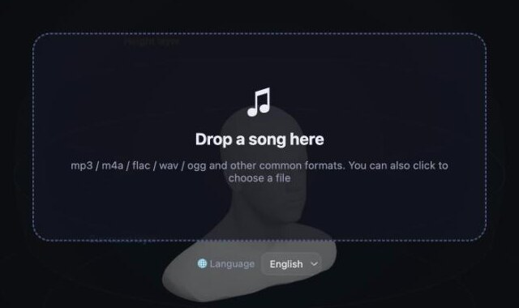
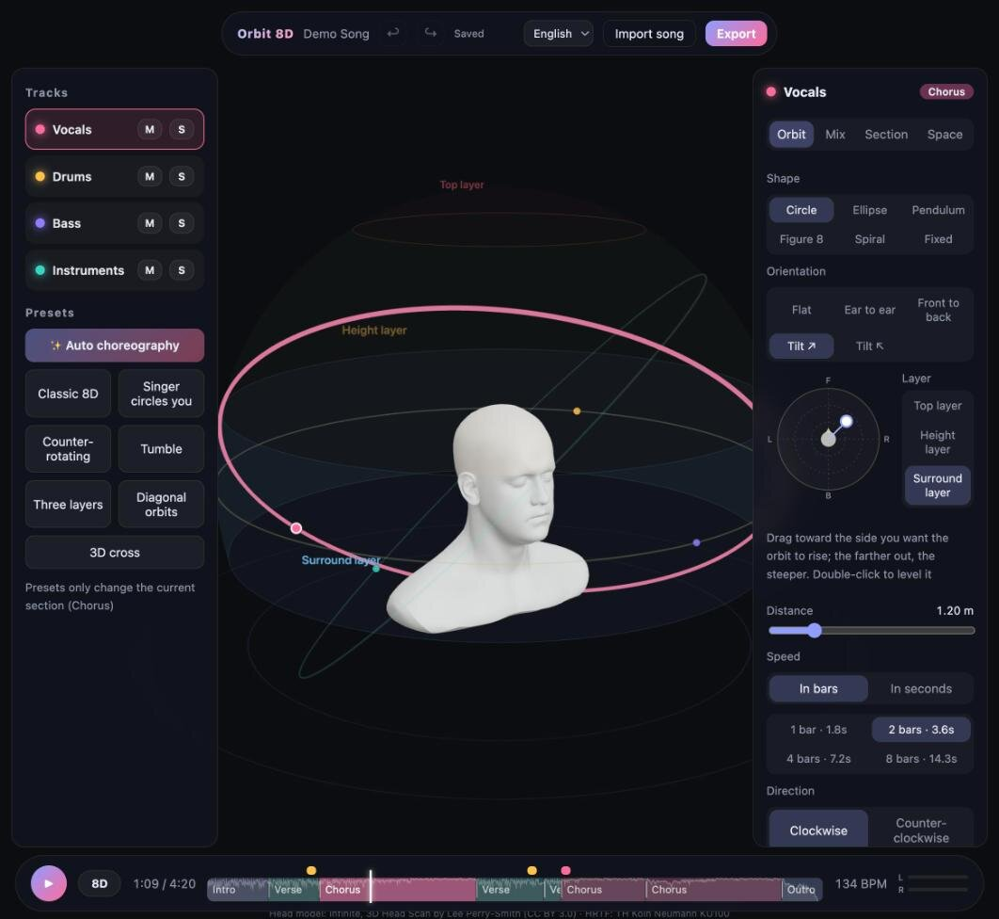
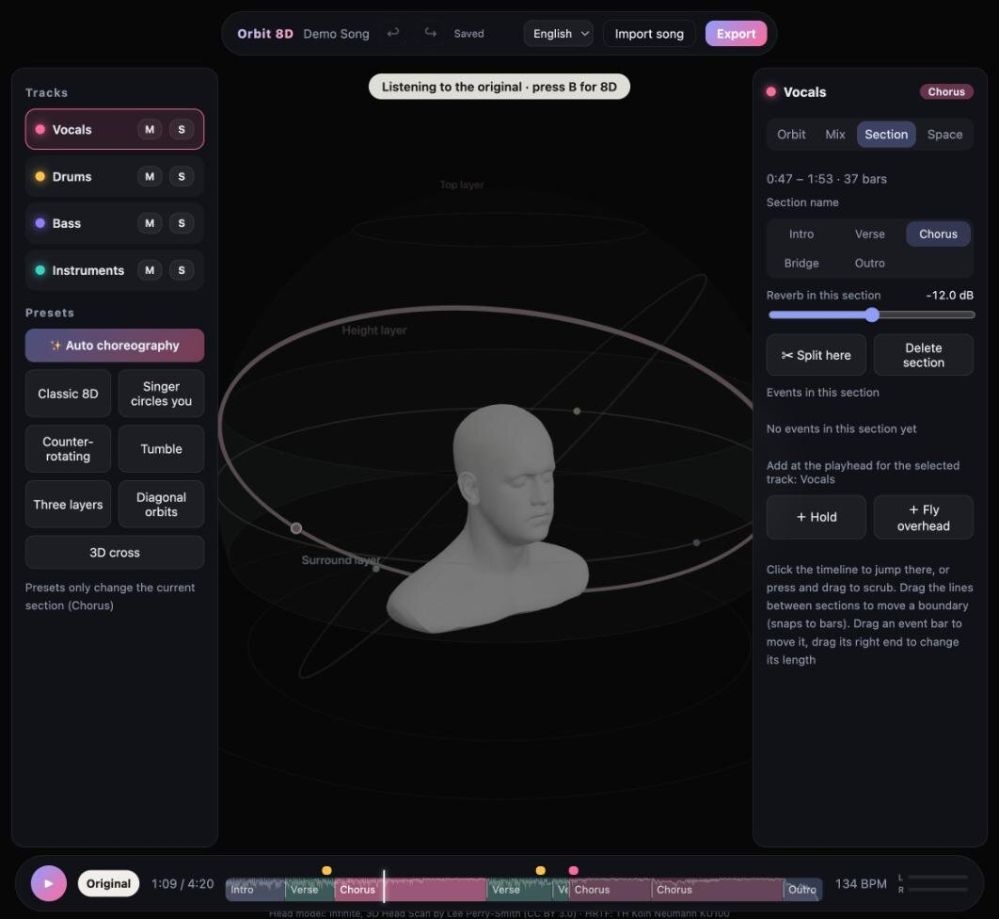
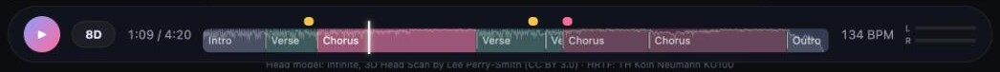
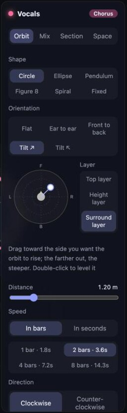
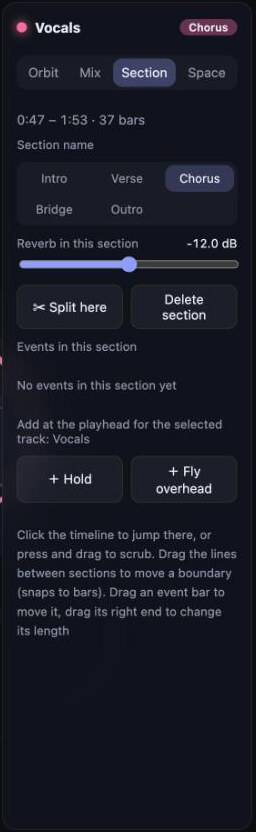
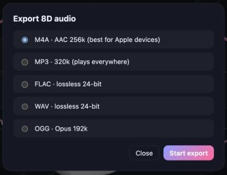

# Orbit 8D User Guide

This guide explains every part of Orbit 8D, from importing your first song to exporting the finished 8D version. If you only want the short version, see the [Quick start in the README](../README.md#quick-start).

**Contents**

1. [Before you start](#1-before-you-start)
2. [Importing a song](#2-importing-a-song)
3. [The screen at a glance](#3-the-screen-at-a-glance)
4. [Listening and comparing](#4-listening-and-comparing)
5. [The 3D view](#5-the-3d-view)
6. [The timeline](#6-the-timeline)
7. [Auto choreography and presets](#7-auto-choreography-and-presets)
8. [Orbit tab: shaping a track's path](#8-orbit-tab-shaping-a-tracks-path)
9. [Mix tab](#9-mix-tab)
10. [Section tab: sections and events](#10-section-tab-sections-and-events)
11. [Space tab](#11-space-tab)
12. [Undo, redo and autosave](#12-undo-redo-and-autosave)
13. [Exporting](#13-exporting)
14. [Tips for a great 8D mix](#14-tips-for-a-great-8d-mix)
15. [Keyboard and mouse reference](#15-keyboard-and-mouse-reference)
16. [Troubleshooting](#troubleshooting)

---

## 1. Before you start

- **Wear headphones.** 8D audio works by sending slightly different sound to each ear. On speakers both ears hear both channels and the effect disappears.
- **Start the app** with `make run` in the project folder (see [Install](../README.md#install) the first time). Your browser opens **http://127.0.0.1:8765**. Keep the terminal window open while you work; closing it stops the app.
- **Language.** The interface follows your browser language (English, 中文 or 日本語; anything else shows English). To change it, use the language menu in the top bar or on the import screen. The page reloads in the new language — your work is saved automatically, so nothing is lost.

## 2. Importing a song

Drag an audio file onto the window, or click the box to choose one. Supported inputs are MP3, AAC/M4A, ALAC, FLAC, WAV/AIFF (PCM), Ogg Vorbis and Opus, up to 300 MB and 20 minutes (both limits can be changed, see [Configuration](../README.md#configuration)).

The song then goes through these stages, shown with a progress bar:

| Stage | What happens | Typical time for a 4-minute song |
|---|---|---|
| Uploading | The file is copied to the local server | a moment |
| Decoding | ffmpeg converts it to 44.1 kHz stereo | a few seconds |
| Separating stems | Demucs splits it into vocals, drums, bass and other instruments | about 1.5 minutes on Apple Silicon; much longer on CPU |
| Detecting tempo, calibrating and finding song sections | Tempo, section boundaries, loudness and tone are measured | about 10–15 seconds |

The first import also downloads the separation model, which adds a few minutes once.

Each song is identified by its content, so importing the **same file** again opens it instantly with your saved edits. When you reload the page, the last song reopens automatically.

## 3. The screen at a glance

| Area | What it's for |
|---|---|
| **Top bar** | Song title, undo ↩ / redo ↪, save status, language menu, **Import song**, **Export** |
| **Left panel** | The four tracks (click to select, **M** mute, **S** solo), **✨ Auto choreography** and the presets |
| **3D view** | The head, one orbit per track, and a coloured dot showing where each track is right now |
| **Right panel** | Settings for the selected track in the current section, on four tabs: **Orbit**, **Mix**, **Section**, **Space** |
| **Bottom bar** | Play, the **8D / Original** switch, time, the timeline, tempo (BPM) and the left/right ear level meter |

**"Current section" is always the section under the playhead.** When the song plays into the next section, the 3D orbits and the right panel switch to that section automatically. The coloured label at the top right of the panel (for example *Chorus*) tells you which section you are editing.

Track colours: **Vocals** pink, **Drums** yellow, **Bass** purple, **Instruments** teal.

## 4. Listening and comparing

- Press **Space** (or the round play button) to play or pause. **←** and **→** jump 5 seconds.
- **Click** anywhere on the timeline to jump there. **Press and drag** to scrub: the playhead, the dots and the panels follow while you drag, and playback continues from where you let go.
- The **level meter** on the right of the bottom bar shows how loud each ear is. Watching it swing from left to right is a quick way to see the 8D effect working.

### Comparing with the original

Press **B** (or click the **8D** button next to Play) to switch to the original song; press **B** again to return to 8D. Both versions play in perfect sync and switch with a short crossfade. They are loudness-matched, so you compare the sound itself — timbre and space — and not just which one is louder. While you listen to the original, the 3D view turns grey and a label reminds you.

## 5. The 3D view

- **Rotate** by dragging, **zoom** with the scroll wheel, **pan** with a right-button drag. *Reset view* is on the Space tab.
- Each track has an **orbit** (its path) and a **dot** (where it is right now). The selected track's orbit is thicker and brighter and its dot is larger with a white rim; the other tracks are drawn thinner and fainter.
- **Click an orbit or a dot** to select that track (or click its name in the left panel).
- The **stereo tracks** (drums and instruments) are really two sources, left and right. They are drawn as one dot in the middle; when selected, a lighter band along the orbit shows how wide the pair is (the *Stereo width* setting).
- The faint **dome** has three layers, named on its surface: **Surround layer** (ear height, −15° to 15°), **Height layer** (15° to 60°) and **Top layer** (60° to 90°, overhead). The layer the selected track is in lights up slightly.
- **Distance handle:** the small white ring on the left side of the selected orbit. Drag it to move the orbit closer (louder) or farther away (quieter).
- **Start angle:** while paused, you can drag the selected dot along its orbit (circle, ellipse, spiral and fixed shapes).
- The two faint circles below the head mark 1 m and 2 m.

## 6. The timeline

The timeline replaces the usual progress bar. From bottom to top it shows:

- **Section blocks** — intro and outro are blue-violet, verses teal, choruses pink, bridges gold. The block under the playhead is highlighted.
- **Loudness curve** — a faint line across the blocks showing how loud the original is over time, so you can spot the big moments.
- **Event bars** above the blocks — yellow for **Hold**, pink for **Fly overhead**.
- **Playhead** — the white vertical line.

What you can do on the timeline:

| Action | How |
|---|---|
| Jump | Click a block |
| Scrub | Press and drag along the blocks |
| Move a section boundary | Drag the thin line between two blocks. It snaps to bar lines, and each section keeps at least one bar. |
| Move an event | Drag the event bar. It snaps to beats; hold **⌥/Alt** to place it freely. It cannot pass another event of the same kind on the same track. |
| Change an event's length | Drag the right end of the event bar (0.5–30 seconds) |
| Select / delete an event | Click the event bar (it gets a white outline), then press **Delete** or **Backspace**. **Esc** deselects. |

Hover over a block or an event bar to see its name and time.

## 7. Auto choreography and presets

When a song opens for the first time, Orbit 8D applies its **auto choreography**. It listens for the song's structure and gives each section its own motion:

| Section | Motion | Reverb |
|---|---|---|
| Intro and outro | A slow spiral raised to about 35°, turning half as fast | +4 dB |
| Verse | Classic 8D: everything circles the head at ear height | default |
| Chorus | Twice as fast; vocals and instruments on opposite 45° diagonal orbits; bass stays in front | default |
| Bridge | 3D cross: vocals loop over your head from ear to ear, instruments from front to back | +2 dB |

It also adds two kinds of **events**: vocals and instruments **fly overhead** for two bars at the start of the loudest chorus, and in every verse of eight bars or more the vocals **hold** still for one bar about three quarters of the way through.

Section detection is automatic and approximate. If a section is labelled wrongly, rename it on the Section tab, drag its boundaries, or just change its orbits — the label only chooses the starting motion.

Click **✨ Auto choreography** at any time to rebuild the choreography from scratch. This replaces your current edits (you can undo it).

### Presets

Presets set up all four tracks at once. **When the song has several sections, a preset changes only the current section** (the hint under the buttons says which one). When the scene is a single section, the preset replaces the whole scene.

| Preset | What you hear |
|---|---|
| Classic 8D | The whole song circles your head at ear height, in time with the music |
| Singer circles you | Only the vocals move; drums and instruments stay put, spread wide |
| Counter-rotating | Instruments turn the other way; drums turn at half speed |
| Tumble | Vocals loop over your head from front to back; drums and bass stay in front |
| Three layers | Vocals overhead, instruments on the height layer turning the other way, drums at ear height, bass in front |
| Diagonal orbits | Vocals tilted up toward the front-right, instruments toward the front-left, turning in opposite directions |
| 3D cross | Vocals loop from ear to ear over your head, instruments from front to back, drums circle at ear height |

## 8. Orbit tab: shaping a track's path

Settings here apply to the **selected track** in the **current section**.

- **Shape**
  - *Circle* — a steady circle.
  - *Ellipse* — a circle squashed front-to-back, so the sound passes closer in front of and behind you than at the sides (*Ellipse flatness* sets how much).
  - *Pendulum* — swings back and forth instead of going all the way round (*Swing* sets how far).
  - *Figure 8* — swings sideways while bobbing up and down twice per cycle (*Swing* and *Up/down wave*).
  - *Spiral* — circles while slowly rising and falling over four turns (*Up/down wave*).
  - *Fixed* — does not move; set its direction with *Start angle* and *Height*.
- **Orientation** tilts the whole orbit:
  - *Flat* — horizontal.
  - *Ear to ear* — a vertical loop: left ear → over the top → right ear.
  - *Front to back* — a vertical loop: in front → over the top → behind.
  - *Tilt ↗* / *Tilt ↖* — tilted 45° up toward the front-right or front-left.
- **Tilt pad** (the round pad) gives full control: drag the white dot toward the side you want the orbit to rise. The farther from the centre, the steeper the tilt — at the edge the orbit is vertical. Double-click the pad to level it again.
- **Layer** moves the orbit to ear height (*Surround layer*), 35° up (*Height layer*) or 75° up (*Top layer*).
- **Distance** — 0.5 to 4 m. Closer sounds louder and more intimate.
- **Speed** — either in **bars** per turn (1, 2, 4 or 8 bars; the button also shows the time in seconds for this song's tempo), which keeps the motion in time with the music, or in **seconds** per turn (2–30 s).
- **Direction** — clockwise or counter-clockwise, seen from above.
- **Fine tuning** (collapsed at the bottom) — exact *Start angle*, *Height*, *Front/back tilt*, *Left/right tilt* and *Turn*.

## 9. Mix tab

Mix settings apply to the selected track for the **whole song** (they are not per section).

- **Volume** — −24 to +12 dB.
- **Stereo width** (drums and instruments only) — how far apart the left and right sources are, 0–90°. The band on the orbit in the 3D view shows it.
- **Reverb send** — how much of this track goes into the room reverb (0–100%).

**Mute (M)** and **Solo (S)** are in the left panel. Soloing any track mutes all tracks that are not soloed. Muting a track also mutes its deep bass.

## 10. Section tab: sections and events

- The top line shows the section's time range and length in bars.
- **Section name** — Intro, Verse, Chorus, Bridge or Outro. Renaming only changes the label and its colour; it does not change the orbits.
- **Reverb in this section** — −24 to 0 dB. Reverb changes smoothly across section boundaries.
- **✂ Split here** — cuts the section in two at the playhead (snapped to the nearest bar line). Both halves start with the same settings.
- **Delete section** — removes the section; its time goes to the previous section (or to the next one if it is the first).
- **Events in this section** — each hold or fly-over with its time and tracks; **×** deletes it.
- **Add at the playhead for the selected track** — **+ Hold** stops the track's movement for one bar (it slows down over half a second, holds still, then speeds up again); **+ Fly overhead** sends the track up over your head and back over two bars. Move and resize events on the timeline afterwards.

Limits: up to 16 sections and 64 events. Two events of the same kind cannot overlap on the same track.

## 11. Space tab

- **Room** — the reverb character: *Small room*, *Hall* (default) or *Church*. The amount of reverb is set per section (Section tab) and per track (Mix tab).
- **Darken behind you** — when a sound goes behind your head, its high frequencies are softened by this much (0–12 dB). This mimics what happens with real ears and makes front and back easier to tell apart.
- **Show the three-layer dome grid** — turns the dome in the 3D view on or off.
- **Reset view** — puts the 3D camera back to its starting position.

## 12. Undo, redo and autosave

- Every change is **saved automatically** about a second after you stop editing. The top bar shows *Saving…*, then *Saved*. If saving fails it says so and retries a few seconds later.
- Saved scenes belong to the song (they are stored with the project, not in the browser), so they survive reloads, restarts and switching browsers.
- **Undo** with **⌘Z / Ctrl+Z** or ↩ in the top bar, **redo** with **⇧⌘Z / Ctrl+Shift+Z / Ctrl+Y** or ↪. Up to 100 steps are kept. A continuous drag (a slider, the tilt pad, a boundary) counts as one step. The undo history is cleared when you open another song.

## 13. Exporting

Click **Export** and choose a format:

| Format | Details | Cover art |
|---|---|---|
| M4A | AAC 256 kbps — best for Apple devices | ✔ |
| MP3 | 320 kbps — plays everywhere | ✔ |
| FLAC | Lossless, 24-bit | ✔ |
| WAV | Lossless, 24-bit | — |
| OGG | Opus 192 kbps | — |

The export is rendered at full quality on your computer (about 10 seconds for a 4-minute song after it starts), then downloaded as `Artist - Title (8D).<ext>`. The title (with " (8D)"), artist and album are copied from the original. The finished file is also kept in `data/exports/`, and exporting the same scene in the same format again is instant.

The export sounds the same as the preview. It is mastered to a comfortable level with a true-peak ceiling of −1 dBTP, which usually makes it a few dB quieter than a loud commercial master — this keeps the song's dynamics intact.

## 14. Tips for a great 8D mix

- **Keep the vocals clear.** Slower, smoother vocal motion (4–8 bars per turn) is easier to follow than fast spinning.
- **Use speed changes for energy.** Faster orbits in the chorus and slower ones in quieter parts make the motion follow the song.
- **Holds and fly-overs are spices.** One or two per song feel dramatic; too many feel busy.
- **Keep the bass grounded.** A fixed bass in front (as in most presets) makes everything else feel more stable.
- **Compare often.** Press **B** to check that the 8D version still sounds like the song.
- **Mind the distance.** Very close orbits (0.5 m) are loud and intense; 1–2 m sounds more natural.

## 15. Keyboard and mouse reference

| Input | Action |
|---|---|
| **Space** | Play / pause |
| **← / →** | Jump back / forward 5 seconds |
| **B** | Switch between 8D and the original |
| **⌘Z / Ctrl+Z** | Undo |
| **⇧⌘Z / Ctrl+Shift+Z / Ctrl+Y** | Redo |
| **Delete / Backspace** | Delete the selected event |
| **Esc** | Deselect the event |
| **⌥/Alt** while dragging an event | Place it freely (no snapping) |
| Drag / scroll / right-drag in the 3D view | Rotate / zoom / pan |
| Click an orbit or dot | Select that track |
| Drag the white ring | Change the selected orbit's distance |
| Drag a dot (while paused) | Change the start angle |
| Double-click the tilt pad | Level the orbit |
| Click / drag on the timeline | Jump / scrub |
| Drag a line between sections | Move the boundary |
| Drag an event bar / its right end | Move / resize the event |

## Troubleshooting

**I can't hear any 8D effect.**
Use headphones. Check that the button next to Play says **8D** (not **Original**), that no track is muted by accident, and that the level meter is moving.

**The sound drops out or crackles in the preview.**
The preview renders every track in real time. Close other heavy browser tabs and applications and try again. The export is not affected — it is rendered offline at full quality.

**A song fails during import.**
The message tells you why (for example an unsupported codec or a file without audio). Convert the file to MP3, M4A, FLAC or WAV and try again. If the app was closed during processing, import the same file again to retry.

**"ffmpeg was not found".**
Install ffmpeg (`brew install ffmpeg` on macOS) and restart the app.

**"Cannot reach the local service".**
The server has stopped. Run `make run` again and reload the page.

**Section detection got the structure wrong.**
It is a best guess from loudness, timbre and where the vocals are. Drag the boundaries, split or delete sections, and rename them — or ignore the labels and edit the orbits directly.

**Exporting is slow or the computer runs out of memory.**
Exporting a 4-minute song briefly needs about 5–6 GB of memory. Close other large applications and try again.

**Where are my files?**
Everything is in the `data/` folder (see [Your data](../README.md#your-data)). Detailed error information is in `data/logs/orbit8d.log`.
